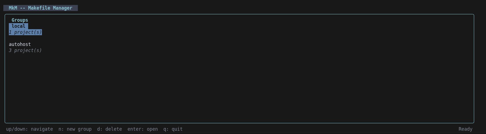
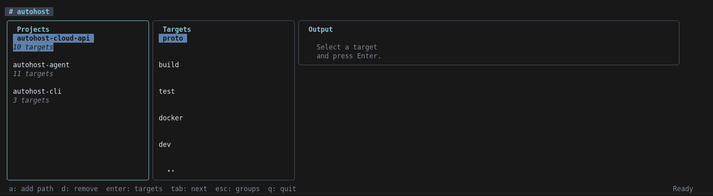
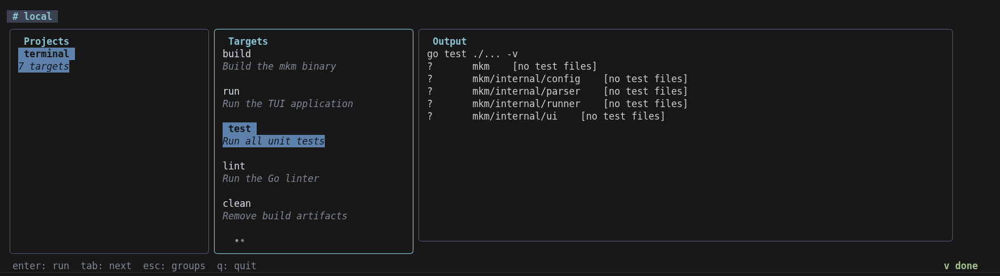

# mkm — Makefile Manager TUI

A terminal UI for organizing and running Makefile targets across multiple projects, built with [Bubble Tea](https://github.com/charmbracelet/bubbletea).


---

## Screenshots

**Groups screen** — create and manage project groups



**Main screen** — browse projects and their Makefile targets



**Live output** — target output streams in real time



---

## What is it?

`mkm` lets you group your projects, browse their Makefile targets, and run them — all without leaving the terminal. Instead of `cd`-ing into each project and remembering target names, you manage everything from one interface.

---

## Features

- **Groups** — organize projects into named groups (e.g. `work`, `personal`, `infra`)
- **Auto-discovery** — add a directory and `mkm` recursively finds all `Makefile` projects inside it
- **Target browser** — lists every target from a project's Makefile, with descriptions parsed from comments
- **Live output** — stdout and stderr stream in real time to the output panel
- **Persistent config** — groups and projects are saved to `~/.config/mkm/config.json`
- **First-run bootstrap** — on first launch, auto-discovers projects in the current directory

---

## How it works

```
Groups screen
  └── Select a group → Main screen
        ├── Projects panel  (left)
        ├── Targets panel   (center)
        └── Output panel    (right)
```

1. On first run, `mkm` scans the current directory for Makefiles and creates a `local` group.
2. From the **Groups screen** you create or delete groups.
3. Inside a group you add project paths. A single path can be a project itself or a parent directory — `mkm` walks it recursively.
4. Select a project → select a target → press `Enter` to run it. Output streams live in the right panel.

---

## Keyboard shortcuts

### Groups screen

| Key | Action |
|-----|--------|
| `↑ / ↓` | Navigate groups |
| `n` | New group |
| `d` | Delete group |
| `Enter` | Open group |
| `q` | Quit |

### Main screen

| Key | Action |
|-----|--------|
| `Tab / →` | Next panel |
| `Shift+Tab / ←` | Previous panel |
| `↑ / ↓` | Navigate list |
| `Enter` | Select project / Run target |
| `a` | Add project path (projects panel) |
| `d` | Remove project (projects panel) |
| `Esc` | Back to groups |
| `q` | Quit |

### Output panel

| Key | Action |
|-----|--------|
| `↑ / ↓` | Scroll output |

---

## Installation

### Prerequisites

- Go 1.21 or newer
- `make` available in `$PATH`

### Install with `go install`

```bash
go install github.com/YOUR_USER/mkm@latest
```

> Replace `YOUR_USER/mkm` with the actual repository path once published.

### Build from source

```bash
git clone https://github.com/YOUR_USER/mkm
cd mkm
make build        # produces ./mkm binary
```

Install to your Go bin:

```bash
go install .
```

---

## Usage

```bash
# Launch from any directory
mkm

# On first run, projects in the current directory are auto-discovered
```

---

## Configuration

Config is stored at `~/.config/mkm/config.json`. It is managed automatically by the TUI — no manual editing needed.

```json
{
  "groups": [
    {
      "name": "work",
      "projects": [
        "/home/user/workspace/api",
        "/home/user/workspace/frontend"
      ]
    }
  ]
}
```

---

## Project structure

```
mkm/
├── main.go                  Entry point, first-run bootstrap
├── go.mod
├── Makefile                 Build, run, test, lint targets
└── internal/
    ├── config/config.go     Persistent config (load/save/groups/projects)
    ├── parser/parser.go     Makefile parser (targets + descriptions)
    ├── runner/runner.go     Executes make targets, streams output
    └── ui/
        ├── model.go         Bubble Tea model, update logic, commands
        └── styles.go        Lipgloss styles and colors
```

---

## Development

```bash
make build    # build binary
make run      # build and run
make test     # run tests
make lint     # go vet
make clean    # remove binary
```

---

## Dependencies

| Package | Purpose |
|---------|---------|
| [charmbracelet/bubbletea](https://github.com/charmbracelet/bubbletea) | TUI framework |
| [charmbracelet/bubbles](https://github.com/charmbracelet/bubbles) | List, viewport, text input components |
| [charmbracelet/lipgloss](https://github.com/charmbracelet/lipgloss) | Terminal styling |
